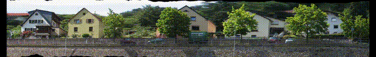
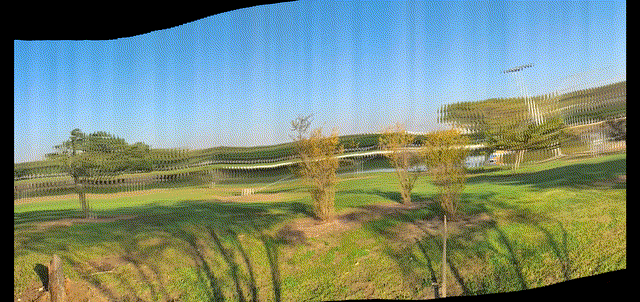
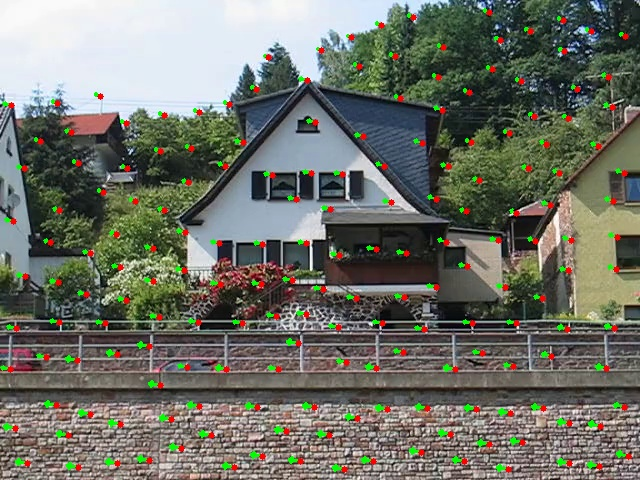
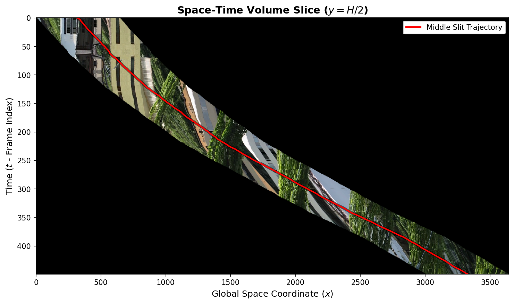
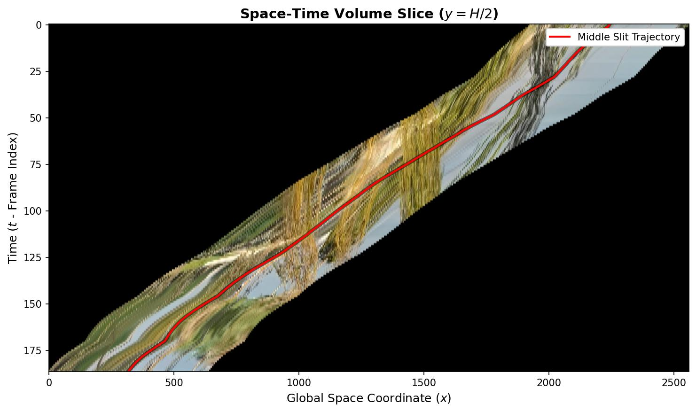
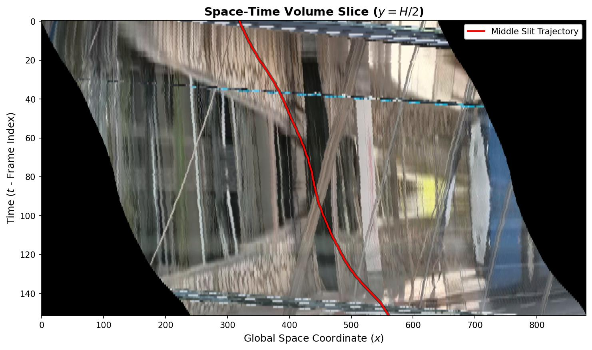

# Stereo Mosaicing


**Turns a panning video into a wide-angle panorama using pushbroom slit-scan rendering and Lucas-Kanade optical flow stabilization.**

---

## What This Is

Solo assignment for *Image Processing* (course 67829) at the Hebrew University of Jerusalem. Implements the stereo mosaicing / pushbroom camera model from the course lectures: motion is estimated with Shi-Tomasi corner detection and Lucas-Kanade optical flow, then a slit-scan compositor sweeps a virtual vertical slit across the scene to stitch a seamless panorama.

---

## Results

**Changing Viewpoint** — same video, different slit positions produce different perspective angles


**Good result (filmed)** — clean lateral pan, well-stabilized output


**Bad result / failure mode** — non-translational motion breaks the translation-only motion model


---

## How It Works

```
frame_00000.jpg
frame_00001.jpg   ──►  Motion      ──►  Global     ──►  Vertical    ──►  Slit-Scan   ──►  Crop
      ...               Estimation       Alignment       Stabilize        Render           Jitter
frame_NNNNN.jpg
```

1. **Load frames** — reads `frame_XXXXX.jpg` files sorted numerically from an input directory.
2. **Motion estimation** — Shi-Tomasi corners are tracked across consecutive frames with Lucas-Kanade optical flow; median of flow vectors gives a robust per-frame (dx, dy) translation.
3. **Global alignment** — local translations are accumulated into a global coordinate system anchored to the center frame, going backward and forward.
4. **Vertical stabilization** — the Y component of each global transform is applied (removing camera shake), while X is left untouched to preserve the scanning motion.
5. **Slit-scan compositing** — a thin vertical slit is swept across the stabilized frames and pasted onto a wide canvas using sub-pixel extraction (`getRectSubPix`). Different slit positions produce different output panoramas from the same input.
6. **Jitter crop** — the horizontal offset introduced by the moving slit is compensated so all output panoramas share identical dimensions.

---

## Visualizations

**Optical flow** — Shi-Tomasi features (red) tracked across frames via Lucas-Kanade (green arrows)



**Space-time volume slice (x,t)** — the red line shows the slit trajectory used to synthesize the panorama



**Translation vs. rotation inputs** — varying streak slopes indicate depth/parallax (left, translation); parallel streaks indicate zero parallax (right, rotation fails)

| Left: varying slopes = depth/parallax | Right: parallel streaks = zero parallax |
|:---:|:---:|
|  |  |

---

## Run It

```bash
# Install dependencies
uv sync

# Generate 1 panorama (default)
uv run python main.py --input ./frames --output ./out

# Generate 5 panoramas at different slit positions
uv run python main.py --input ./frames --output ./out --n-frames 5
```

Output files are saved as `panorama_0.jpg`, `panorama_1.jpg`, ... in the output directory.

**Arguments:**

| Flag | Default | Description |
|------|---------|-------------|
| `-i` / `--input` | *(required)* | Directory of `frame_XXXXX.jpg` files |
| `-o` / `--output` | `./output` | Output directory (created if absent) |
| `-n` / `--n-frames` | `1` | Number of panorama views to generate |

---

## Tech Stack

Python 3.13 · OpenCV (feature detection, optical flow, affine warping) · NumPy (matrix ops, median filtering) · Pillow (image output)
